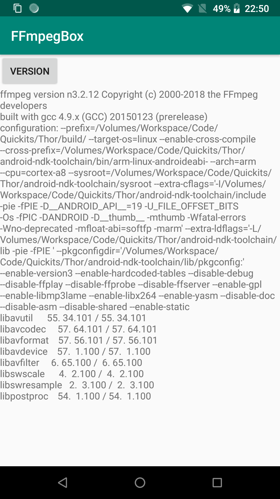
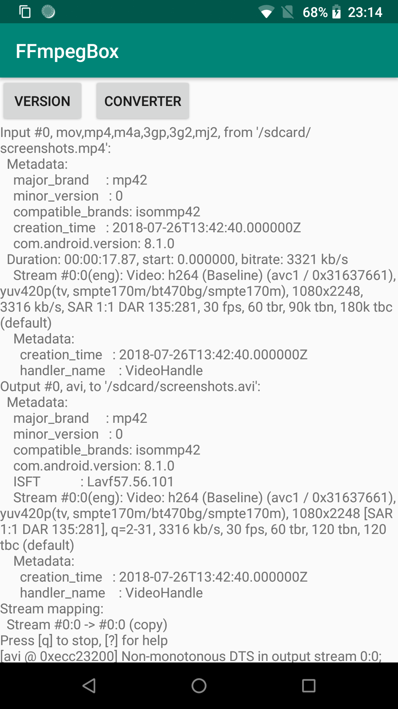

# FFmpegBox

[](https://jitpack.io/#cn.quickits/FFmpegBox)

📦 FFmpeg command line tool box for android

- API Flow Based on RxJava
- FFmpeg binary Based on [Thor](https://github.com/Quickits/Thor)

|           Version            |           Converter            |
| :--------------------------: | :----------------------------: |
|  |  |

## Download

- Add the JitPack repository to your build file

```gradle
allprojects {
    repositories {
        maven { url 'https://jitpack.io' }
    }
}
```

- Add the dependency

```gradle
dependencies {
    implementation 'cn.quickits:FFmpegBox:1.0.1'
}
```

## Usage

### Init

```kotlin
class YourApplication : Application() {
    override fun onCreate() {
        super.onCreate()
        FFmpegBox.init(this)
    }
}
```

### Execute example

```kotlin
FFmpegBox.get().exec(arrayOf(
                    "-i", "/sdcard/screenshots.mp4",
                    "-vcodec", "copy",
                    "/sdcard/screenshots.avi"))
  .observeOn(AndroidSchedulers.mainThread())
  .subscribe(
    { status ->
    msg.append(status.msg)
    msg.append("\n")
    },
    { error -> error.printStackTrace()
  })
```

## License

Apache License Version 2.0

Copyright (c) 2017-present, GavinLiu
